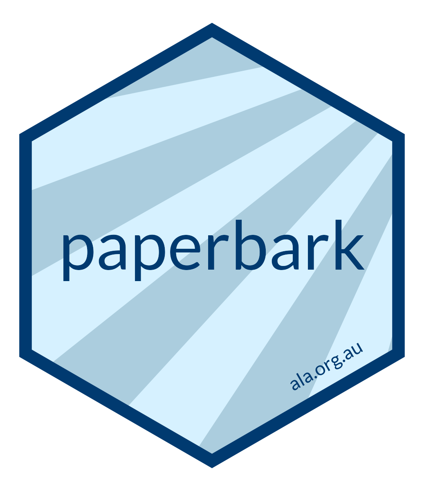

# delma <a href="https://delma.ala.org.au/Python/"></a>

<!-- badges: start -->

[](https://pypi.org/project/delma-python/)

<!-- badges: end -->

## Overview

`delma` is a package for converting metadata statements written in
markdown, RMarkdown or Quarto markdown to [Ecological Metadata
Language](https://eml.ecoinformatics.org) (EML). It is named for a genus
of legless lizards that are endemic to Australia, whose name happens to
contain the letters ‘e’, ‘m’ and ‘l’.

The logo depicts a striped legless lizard (*Delma impar*) in the style
of the classic mobile game ‘snake’, a play on the observation that
*Delma* are often mistaken for snakes. It was drawn by Martin Westgate.

If you have any comments, questions or suggestions, please [contact
us](mailto:support@ala.org.au).

## Installation


### Python Package Index
To install the latest release in the Python Package Index, run the following in your terminal:

``` bash
pip install delma-python
```

To upgrade to the latest release:
``` bash
pip install --upgrade delma-python
```

### Github
``` bash
git clone https://github.com/AtlasOfLivingAustralia/delma_python.git
# go into delma-python/delma
pip install .
```

## Basic usage

The primary use case for `delma` is to build metadata statements for
sharing biodiversity data. The first step is to create a markdown file,
and add any headings that you like that conform to the EML standard. The
header ‘level’ (i.e. number of `#`) is used to designate the degree of
nesting. If you don’t want to start from scratch, you can use the
example statement provided:

``` python
import delma
delma.create_md()
```

Now there will be a `metadata.md` file in your current working directory.  
You will need to edit this so all relevant metadata for your dataset is there.  

To convert this edited markdown document to EML, use:

``` python
delma.write_eml_xml()
```

Note that EML documents use the extension `.xml`. To check that your
document is formatted in accordance with the EML standard, use:

``` python
delma.check_eml_xml("eml.xml")
```

For a more detailed description of delma’s capabilities and methods, see
the ‘Quick start guide’ vignette.

## Citing `delma`

The current recommended citation is:

> Buyan A, Kellie D, Westgate M (2023). delma: Atlas of Living Australia (ALA) Data and 
> Resources in Python. Python package version 0.1.0. 